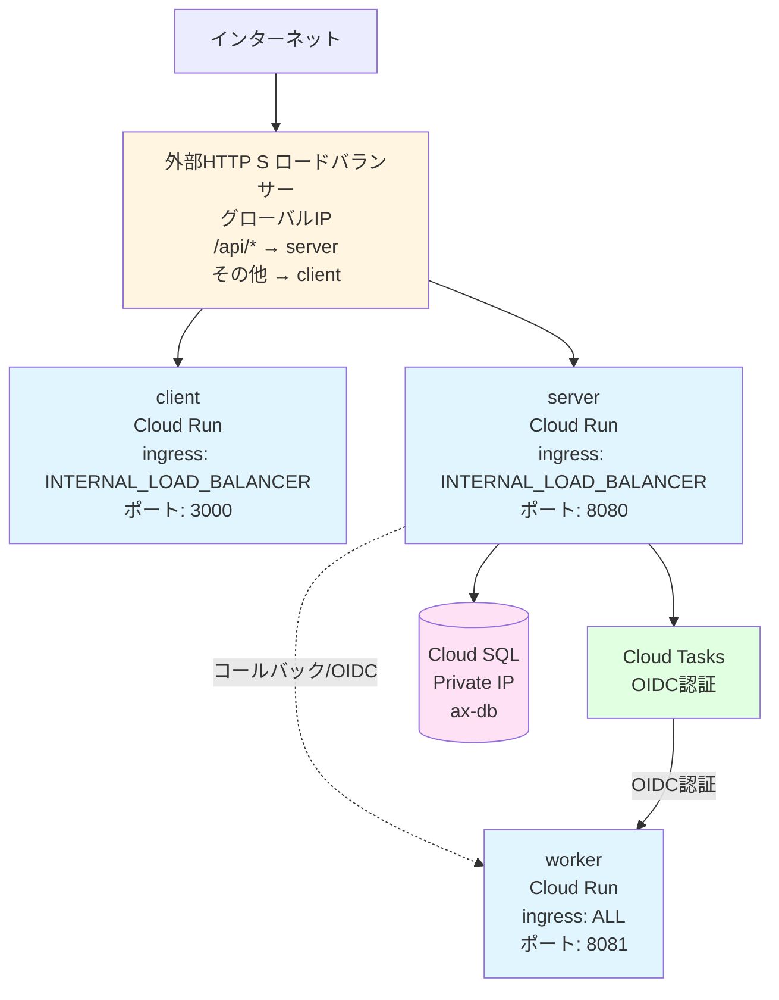
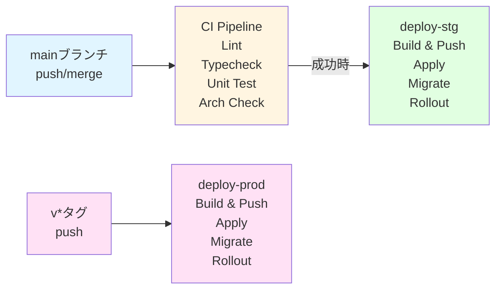
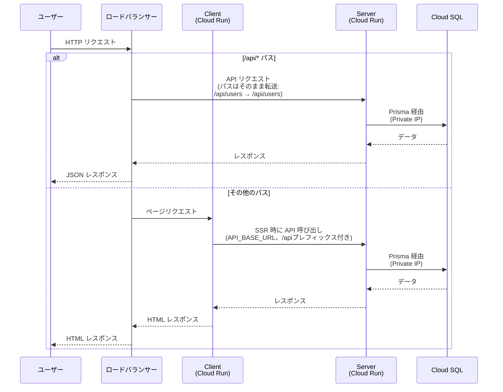
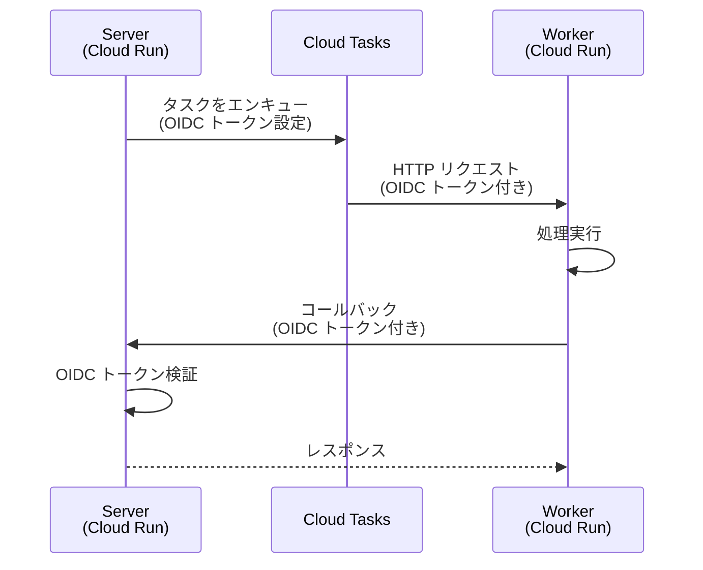

# システムアーキテクチャ

このドキュメントでは、ax-saas-template のシステム全体のアーキテクチャ、ネットワーク構成、デプロイフローについて説明します。

## 全体構成

## アプリケーション構成

### Client (`apps/client`)

- **役割**: Next.js アプリケーション（SSR）
- **技術スタック**: Next.js (App Router), React, Tailwind v4, shadcn/ui
- **アクセス**: ロードバランサー経由でのみアクセス可能（`INGRESS_TRAFFIC_INTERNAL_LOAD_BALANCER`）
- **API 呼び出し**: 内部通信のため、直接 Cloud Run の URL を使用（`API_BASE_URL` 環境変数）
- **アーキテクチャ**: FSD (Feature-Sliced Design) ライクな構成
  - `features` 間の直接参照は禁止されています。共通コンポーネントが必要な場合は `shared` に昇格させてください。

詳細は [Client 開発ガイド](development.md#client) を参照してください。

**デフォルト設定**:
- ポート: `3000`
- サービス名: `ax-client`（Cloud Run）
- ingress: `INGRESS_TRAFFIC_INTERNAL_LOAD_BALANCER`

### Server (`apps/server-node`)

- **役割**: REST API サーバー（Hono）
- **技術スタック**: Hono, Prisma, Result 指向（ROP）、クリーンアーキテクチャ
- **アクセス**: Worker からのコールバック（VPC内部経由）とロードバランサー経由のアクセスの両方を許可（`INGRESS_TRAFFIC_INTERNAL_LOAD_BALANCER`）
- **認証**: 
  - ロードバランサー経由: `allUsers` に `run.invoker` 権限（公開 API）
  - Worker からのコールバック: `ax-worker-sa` に `run.invoker` 権限 + OIDC トークン検証
- **ルータ**: RegExpRouter を採用
- **依存ルール**:
  - **Domain層**: 外部ライブラリ（フレームワーク、DB、バリデーションライブラリ等）への依存禁止。Application層のDTOにも依存しない（純粋な値のみ）。
  - **Application層**: ユースケースの入出力（DTO）を定義。Domain層の純粋関数を利用してロジックを実行。
  - **Infrastructure層**: DB操作や外部API呼び出しの実装。
  - **Integrations層**: 外部SDK（GCP等）の薄いラッパー。`@google-cloud/*` 等の外部ライブラリは必ずここに閉じ込める。
  - `@repo/contracts` (Shared Kernel) は例外として許可されます（型定義・イベント定義の共有のため）。

観測面では、`createHttpLogger` ミドルウェアによりすべてのルートで requestId / method / path / status / durationMs を含む構造化ログが出力され、環境や要件に応じて追加フィールドやログレベルを切り替えられます。アプリの初期化時に `createHttpLogger` が適用されるため、別途実装を追加することなくダッシュボード連携が可能です。

詳細は [Server 開発ガイド](development.md#server) を参照してください。

**デフォルト設定**:
- ポート: `8080`
- サービス名: `ax-server`（Cloud Run）
- ingress: `INGRESS_TRAFFIC_INTERNAL_LOAD_BALANCER`

### Worker (`apps/worker-node`)

- **役割**: バックグラウンド処理（Cloud Tasks から呼び出し）
- **技術スタック**: Hono, Cloud Tasks
- **アクセス**: Cloud Tasks から直接呼び出し（`INGRESS_TRAFFIC_ALL`、認証必須）
- **認証**: `ax-tasks-invoker-sa` のみ `run.invoker` 権限あり（OIDC 認証）

詳細は [Worker 開発ガイド](development.md#worker) を参照してください。

**デフォルト設定**:
- ポート: `8081`
- サービス名: `ax-worker`（Cloud Run）
- ingress: `INGRESS_TRAFFIC_ALL`

## ネットワーク構成

### Cloud Run の ingress 設定

#### Client

- **ingress**: `INGRESS_TRAFFIC_INTERNAL_LOAD_BALANCER`
- **説明**: ロードバランサー経由でのみアクセス可能。直接の外部アクセスは不可。
- **IAM ポリシー**: `allUsers` に `run.invoker` 権限（ロードバランサー経由の公開アクセス用）

#### Server

- **ingress**: `INGRESS_TRAFFIC_INTERNAL_LOAD_BALANCER`
- **説明**: Worker からのコールバック（VPC内部経由）とロードバランサー経由のアクセスの両方を許可。直接の外部アクセスはブロック。
- **IAM ポリシー**:
  - `allUsers`: ロードバランサー経由の公開 API アクセス用
  - `ax-worker-sa`: Worker からのコールバック用（VPC内部経由、OIDC 認証で検証）
- **コールバックエンドポイント**: アプリケーション側で OIDC トークンを検証（`/tasks/callback/*`）

#### Worker

- **ingress**: `INGRESS_TRAFFIC_ALL`
- **説明**: Cloud Tasks から直接呼び出し可能
- **認証**: `ax-tasks-invoker-sa` のみ `run.invoker` 権限あり（OIDC 認証必須）

### ロードバランサー構成

- **種類**: 外部 HTTP(S) ロードバランサー（Application Load Balancer）
- **ルーティング**:
  - `/api/*` → server バックエンド
  - その他 → client バックエンド
- **IP**: グローバル静的IP（`ax-lb-ip`）
- **HTTPS**: オプション（`enable_ssl=true` で有効化、マネージド SSL 証明書）

**注意**: Server側のルーティングには `/api` プレフィックスが付いており、ロードバランサー経由でのアクセスにも対応しています。Client側は `API_BASE_URL` で直接ServerのCloud Run URLを使用していますが、HonoのRPCクライアントが自動的に `/api/users` などのパスを生成するため、型安全性が保たれています。

詳細は [インフラ詳細](../infra/terraform/README.md#6-ネットワーク構成とロードバランサー) を参照してください。

### Cloud SQL

- **接続方式**: Private IP のみ（VPC 内）
- **接続**: Cloud Run は Serverless VPC Connector 経由で接続
- **認証**: Secret Manager の `database-url` を参照
- **デフォルト設定**:
  - インスタンス名: `ax-db`
  - データベース名: `app`
  - ユーザー名: `appuser`

## 非同期処理パターン

### Pub/Sub vs Dispatcher (Cloud Tasks) の使い分け

本アーキテクチャでは、目的と特性に応じて2つの非同期処理パターンを使い分けます。

| パターン | Pub/Sub (Event Bus) | Dispatcher (Cloud Tasks) |
| :--- | :--- | :--- |
| **モデル** | Publish-Subscribe (1対多) | Point-to-Point (1対1) |
| **目的** | **「事実の通知」**: 何かが起きたことをシステム全体に知らせる 例: `UserCreated`, `TaskCompleted` | **「処理の依頼」**: 特定のワーカーに特定の処理を実行させる 例: `EnqueueTask`, `ProcessJob` |
| **結合度** | 疎結合 (Subscriberを知らない) | 密結合 (Workerのエンドポイントを指定) |
| **主な用途** | メール送信、通知、分析ログ送信などの**副作用** | 長時間実行タスク、レート制御が必要なジョブ、確実な実行保証 |

### 推奨実装方針

1.  **ユースケース内**:
    - メイン処理（DB保存など）と副作用（通知など）を分離するために **Pub/Sub (Event)** を使用する。
    - 特定の重い処理を非同期で実行させたい場合は **Dispatcher** を使用する。

2.  **Infrastructure層**:
    - `TaskDispatcher` は Cloud Tasks をラップし、アプリケーションからはインターフェースとして利用する。

## 認証・認可

### Cloud Tasks と Worker の認証

- Worker は `ax-tasks-invoker-sa` サービスアカウントによる OIDC 認証のみ受け付けます
- Cloud Tasks から Worker を呼び出す際は、アプリケーションコード側で OIDC トークンを設定してください
- `server` の SA には `roles/cloudtasks.enqueuer` が付与済みです
- `server` SA は `tasks_invoker` SA を `actAs` できる権限を持っています

### Worker から Server へのコールバック認証

- Worker は `ax-worker-sa` サービスアカウントで実行されます
- Worker から Server へのコールバック時に、VPC内部経由（VPC Connector経由）でアクセスし、OIDC トークンを使用して認証します
- Server は `ax-worker-sa` に `run.invoker` 権限を付与しています
- Server の ingress 設定は `INGRESS_TRAFFIC_INTERNAL_LOAD_BALANCER` で、Worker からの VPC内部アクセスとロードバランサー経由のアクセスを許可しています
- **コールバックエンドポイント（`/tasks/callback/*`）はアプリケーション側で OIDC トークンを検証します**
  - `google-auth-library` を使用して、Google OIDC トークンの署名、issuer、audience、service account email を検証
  - 本番環境では、Worker SA の OIDC トークンがない場合、コールバックは拒否されます
  - 開発環境では OIDC 検証をスキップ（ローカル開発の利便性のため）

## デプロイフロー

### CI/CD パイプライン

### デプロイステップ

#### 1. Build & Push

- コンテナイメージを buildx でビルド（server/worker/client）
- Artifact Registry へ push（`latest` タグ）

#### 2. Apply

- Terraform を GCS Backend で `init` → `apply`
- Cloud Run の `image` はダイジェスト固定 → push 毎に `terraform apply` で差分検知して新 Revision へ
- 依存リソース作成更新 → Cloud SQL ユーザーのパスワードを Secret（GitHub Secrets 優先、なければ Secret Manager の database-url）に合わせて同期

#### 3. Migrate

- Cloud Run Job で `prisma migrate deploy` を実行
- `succeededCount/failedCount` と `completionTime` をポーリングして結果を判定

#### 4. Rollout

- migrate 成功時のみ、新しいリビジョンを作成（`BUILD_SHA` で差分を強制）

詳細は [デプロイガイド](deployment.md) を参照してください。

## データフロー

### ユーザーリクエストの流れ

### バックグラウンド処理の流れ

## 参照ドキュメント

- [開発ガイド](development.md) - 各アプリケーションの開発方法
- [デプロイガイド](deployment.md) - デプロイの詳細手順
- [インフラ詳細](../infra/terraform/README.md) - Terraform の詳細とローカル実行方法
- [ドメインモデル指針](domain-model.md) - DMMFベースのコマンド/イベント/状態遷移の整理
