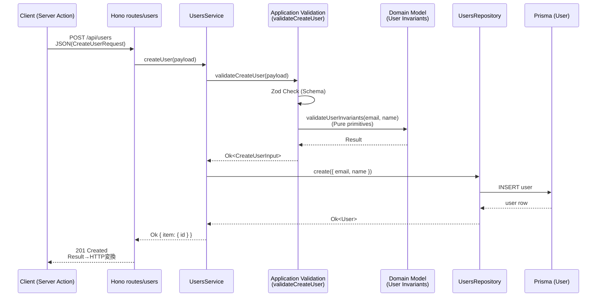
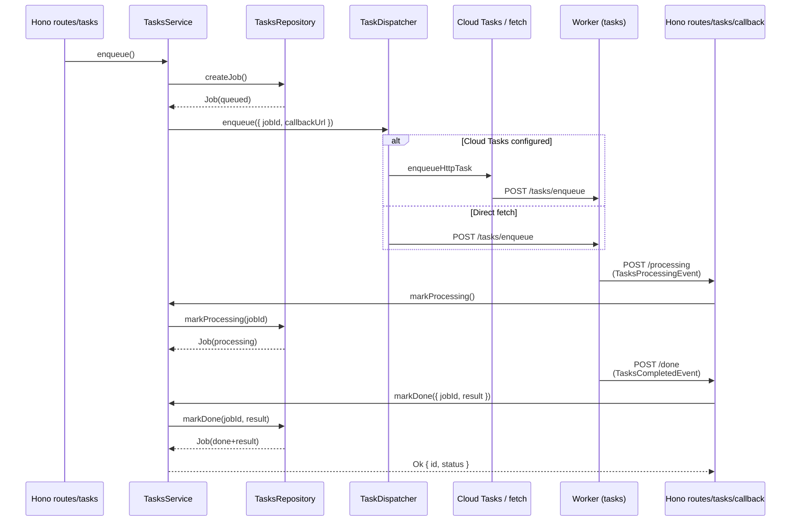

# ドメインモデル指針 (DMMF)

このドキュメントは、`@repo/contracts`で公開されているコマンド／イベント型を軸に、主要コンテキストの状態遷移を整理したものです。DDDおよびDomain Model Management Framework(DMMF)の成果物として、実装・テスト・ドキュメント間のトレーサビリティを維持します。

## Users コンテキスト

- **集約**: ユーザー (`User`)
- **主な状態**: `仮登録` → `有効`
- **識別子**: `id` (数値, 永続化時に採番)

| 区分 | 型 | 説明 |
| --- | --- | --- |
| コマンド | `@repo/contracts` → `UsersCreateCommandSchema` | ユーザー作成要求。アプリケーション層でzodバリデーション済みの入力を保持。 |
| イベント | `UsersCreatedEventSchema` | 状態遷移を表す型定義（将来の拡張用）。現在は実装されていない。 |
| クエリ応答 | `UsersListResponseSchema` / `UsersListItemSchema` | 表示用の読み取りモデル。 |

### ユーザー作成フロー



### 状態遷移

```
匿名 -> (UsersCreateCommand) -> 仮登録
仮登録 -> (UsersCreatedEvent) -> 有効
```

- コマンド処理でバリデーションエラーが発生した場合は `Result<_, "Invalid">` を返却し、状態遷移は行われない。
- インフラ層で一意制約違反を検知した場合は `Result<_, "Conflict">` を返却する。

## Tasks コンテキスト

- **集約**: タスク実行ジョブ (`TaskJob`)
- **主な状態**: `queued` → `processing` → `done`
- **識別子**: `jobId` (文字列)

| 区分 | 型 | 説明 |
| --- | --- | --- |
| コマンド | `TasksEnqueueCommandSchema` | 新規ジョブ投入要求。Cloud Tasks または同期呼び出し経由で使用。 |
| イベント | `TasksProcessingEventSchema` / `TasksCompletedEventSchema` | ワーカー側で処理状態を通知。 |
| クエリ応答 | `TaskStatusResponseSchema` / `TaskMetricsResponseSchema` | 状態監視・メトリクス用の読み取りモデル。 |

### ジョブ処理フロー



### 状態遷移

```
未登録 -> (TasksEnqueueCommand) -> queued
queued -> (TasksProcessingEvent) -> processing
processing -> (TasksCompletedEvent) -> done
```

- `TasksProcessingEvent` は Cloud Run ワーカーからの `/tasks/callback/processing` で検証後に適用。
- `TasksCompletedEvent` の `result.finishedAt` は ISO8601 文字列として保存され、クライアントは `TaskStatusResponseSchema` 経由で利用。

## トレーサビリティ

| 成果物 | 参照先 | 目的 |
| --- | --- | --- |
| HTTP 契約 | `packages/contracts/src/http/*.ts` | ルート/クライアント間の入出力を統一。 |
| コマンド／イベント型 | `packages/contracts/src/events/*.ts` | ドメイン/ユースケース間のメッセージを定義。 |
| アプリケーション層 | `apps/server-node/src/features/**/application` | Resultチェインでコマンド処理を実装。DTO定義もここで行う。 |
| ドメイン層 | `apps/server-node/src/features/**/domain` | 不変条件と状態遷移を判定。**DTOには依存せず純粋な値を受け取る**。 |
| テスト | `apps/server-node/src/__tests__` | シナリオ/契約テストでコマンド処理の流れを検証。 |

今後、新たなコマンド／イベントを追加する場合は、本ドキュメントと `@repo/contracts` の型を同時に更新し、DMMF成果物として記録してください。
